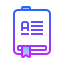

&nbsp;&nbsp;
&nbsp;&nbsp;

### Hi there 👋

-  My name is Vasvi Sood, and I am currently in my third year of college. I enjoy pushing my brain to think about complex problems. That's why I like competitive programming so much.

- On a clear, breezy day, I enjoy going for a bicycle ride. On my idle days, I would curl up on the couch with a good book to read.

-  I also write short stories and poetries ocassionally.

- My motto is "wake up, dress up, and work for your passions," followed by a crazy weekend of travelling and exploring.

<!--
**vasvi-sood/vasvi-sood** is a ✨ _special_ ✨ repository because its `README.md` (this file) appears on your GitHub profile.

Here are some ideas to get you started:

- 🔭 I’m currently working on ...
- 🌱 I’m currently learning ...
- 👯 I’m looking to collaborate on ...
- 🤔 I’m looking for help with ...
- 💬 Ask me about ...
- 📫 How to reach me: ...
- 😄 Pronouns: ...
- ⚡ Fun fact: ...
  -->
